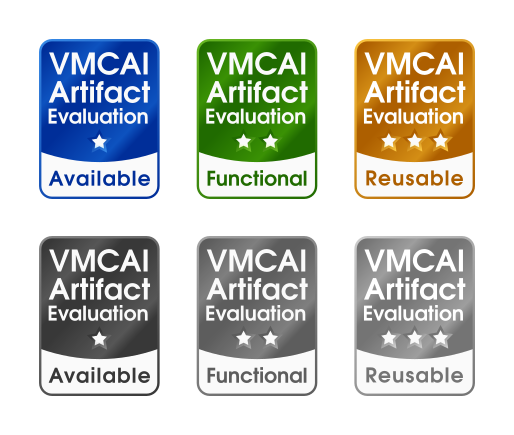

# Badges for artifact evaluations of computer science conferences

Many conferences in computer science started to establish an artifact review process that awards badges to artifacts that pass various review criteria. Although the process is individual, many orient their criteria on [ACM's guidelines](https://www.acm.org/publications/policies/artifact-review-badging) for reviewing artifacts. ACM provides three dimensions with five different badges. Unfortunately, the badges are quite ACM-centric and do not have any kind of license attached. Hence, if you chair an artifact evaluation committee, you are often presented with the issue: where do you get badges for _your_ conference?

This repository tries to solve this problem by providing badges that can be used by anyone. The badges are licensed under [CC0](https://creativecommons.org/publicdomain/zero/1.0/) and originally published for [VMCAI 2020 by Claus Schätzle](https://github.com/schaetzc/vmcai-badges). No attribution is required.

The badges also work when printed in grayscale. Here is an example for VMCAI.



## Usage for organizers
``TODO`` (explain how to change the text, how to generate the .pdfs with Inkscape, link to [source description](src/about-the-sources.md))

## Usage for authors
Download the appropriate `.pdf`s from this repository.

Because LNCS does not provide a standard placement for the badges, you need to experiment a little to find a good place for them.
They should be on the first page and not inside the margins (because the margins will be cut by Springer before publication).

You can start with the following Latex snippet:

```tex
\documentclass{lncs}
\usepackage{graphicx}

\usepackage[firstpage]{draftwatermark}
\SetWatermarkText{\raisebox{14cm}{%
  \includegraphics{vmcai-badges/1-available} \hspace{8cm} \includegraphics{vmcai-badges/2-functional}%
}}
\SetWatermarkAngle{0}
```

The exact positioning depends on your author list, your title size, and the number of lines you use for your affiliations.

Here are some examples
``TODO`` (Latex snippets for LNCS with different placements, different abstract / author / affiliation sizes, links to DOI for available)

## Contributing
If you have your own badges and would like to contribute them to other conferences, feel free to file a pull request so that we can add them here.

## Conference-specific badges
* [VMCAI 2020 badges](vmcai/) ([Call for Artifacts](https://popl20.sigplan.org/home/VMCAI-2020#Call-for-Artifacts))
* [VMCAI 2021 badges](vmcai/) ([Call for Artifacts](https://popl20.sigplan.org/home/VMCAI-2021#Call-for-Artifacts))
