# Badges for artifact evaluations of computer science conferences
Many conferences in computer science started to establish an artifact review process that awards badges to artifacts that pass various review criteria. Although the process is individual, many orient their criteria on [ACM's guidelines](https://www.acm.org/publications/policies/artifact-review-badging) for reviewing artifacts. ACM provides three dimensions with five different badges. Unfortunately, the badges are quite ACM-centric and do not have any kind of license attached. Hence, if you chair an artifact evaluation committee, you are often presented with the issue: where do you get badges for _your_ conference?

This repository tries to solve this problem by providing badges that can be used by anyone. The badges are licensed under [CC0](https://creativecommons.org/publicdomain/zero/1.0/). No attribution is required.


## Usage for organizers
If you want to change the label on the badges, just open one of the [source](src/about-the-sources.md) `.svg` files with Inkscape (or a similar tool of your choice), change the text, and export each badge as a `.pdf`.

Ensure that you have the necessary font (see [About the sources](src/about-the-sources.md)) on your system and that it is embedded in the exported `.pdf`.


## Usage for authors
1. Download the appropriate badges as `.pdf`s from this repository and place them beside your LaTeX files.
2. Add the LaTeX snippet from below to your document and experiment with the placement.
3. Add your DOI as link to the "Available" badge if you received it.

Because LNCS does not provide a standard placement for the badges, you need to experiment a little to find a good place for them.
They should be on the first page and not inside the margins (because the margins will be cut by Springer before publication).

You can start with the following Latex snippet:

```tex
\documentclass{lncs}
\usepackage{showframe}                  % print page margins, remove when positioning is satisfying
\usepackage{graphicx}                   % necessary for inserting .pdfs 
\usepackage{hyperref}                   % "available" badge is a link to the actual DOI 
\usepackage[firstpage]{draftwatermark}  % free badge placement

\SetWatermarkAngle{0}
\SetWatermarkText{\raisebox{12.5cm}{%
  \hspace{0.1cm}%
  \href{https://github.com/danieldietsch/ae-badges}{\includegraphics{1-available}}%
  \hspace{9cm}%
  \includegraphics{2-functional}%
}}
```

The exact positioning depends on your author list, your title size, and the number of lines you use for your affiliations.

A complete example based on [Springer's LaTeX2e Proceedings Templates](https://www.springer.com/gp/computer-science/lncs/conference-proceedings-guidelines) including visible margins is also available as [.tex](examples/lncs/samplepaper.tex) or [.pdf](examples/lncs/samplepaper.pdf).


## Contributing
If you have your own badges and would like to contribute them to other conferences, feel free to file a pull request with the `.svg` and the resulting `.pdf` files so that we can add them here.


## Conference-specific badges
### CAV
* [CAV 2022 badges](pdf/cav-alt/) ([Call for Artifacts](http://i-cav.org/2022/artifact-evaluation/))  

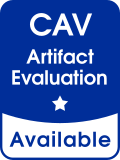 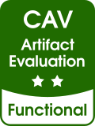 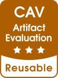


* [CAV 2021 badges](pdf/cav/) ([Call for Artifacts](http://i-cav.org/2021/artifact-evaluation/))  

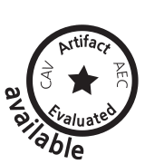 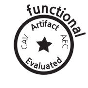 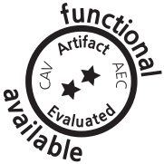 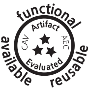 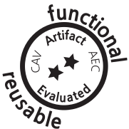

### VMCAI
These badges were originally published for [VMCAI 2020 by Claus Schätzle](https://github.com/schaetzc/vmcai-badges).
* [VMCAI 2021 badges](pdf/vmcai/) ([Call for Artifacts](https://popl20.sigplan.org/home/VMCAI-2021#Call-for-Artifacts))
* [VMCAI 2020 badges](pdf/vmcai/) ([Call for Artifacts](https://popl20.sigplan.org/home/VMCAI-2020#Call-for-Artifacts))  


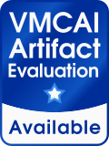 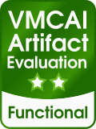 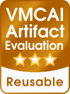  

The badges also work when printed in grayscale:  
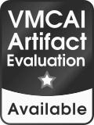 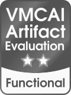 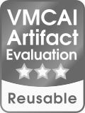